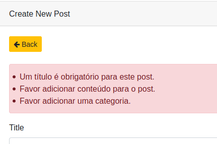

# Exemplo simples de validação usando formRequest

CRUD criado com o ribafs/crud-generator e adaptado para incluir validação

## Criar um novo aplicativo com Laravel 8

laravel new blog

## Criar migration posts

php artisan make:migration create_posts_table

Edite o arquivo criado e altere o método up assim:
```php
    public function up()
    {
        Schema::create('posts', function (Blueprint $table) {
            $table->increments('id');
            $table->string('title')->nullable();
            $table->text('content')->nullable();
            $table->string('category');
            $table->timestamps();
        });
    }
```
## Criar Model

php artisan make:model Post

app/Models/Post.php
```php
<?php
namespace App\Models;

use Illuminate\Database\Eloquent\Model;

class Post extends Model
{
    protected $table = 'posts';

    protected $primaryKey = 'id';

    protected $fillable = ['title', 'content', 'category'];
}
```
## Criar PostRequest

php artisan make:request PostRequest

app/Http/Requests/PostRequest.php
```php
<?php
namespace App\Http\Requests;
use Illuminate\Foundation\Http\FormRequest;

class PostRequest extends FormRequest
{
    public function rules()
    {
        return [
            'title' => 'required|unique:posts|min:4|max:255',
            'content' => 'required',
            'category' => 'required',
        ];
    }

    public function messages()
    {
        return [
            'title.required' => 'Um título é obrigatório para este post.',
            'title.min' => 'O título deve conter no mínimo 4 caracteres.',
            'title.max' => 'O título deve conter no máximo 255 caracteres.',
            'content.required' => 'Favor adicionar conteúdo para o post.',
            'category.required' => 'Favor adicionar uma categoria.'
        ];
    }
}
```
## Criar Controller

php artisan make:controller PostController

app/Http/Controllers/PostController.php

E usar o PostRequest no lugar do Request
```php
<?php
namespace App\Http\Controllers;

use App\Http\Controllers\Controller;
//use App\Http\Requests;
use App\Http\Requests\PostRequest;

use App\Models\Post;
use Illuminate\Http\Request;

class PostController extends Controller
{
    public function index(Request $request)
    {
        $keyword = $request->get('search');
        $perPage = 25;

        if (!empty($keyword)) {
                $posts = Post::where('title', 'LIKE', "%$keyword%")
                ->orWhere('content', 'LIKE', "%$keyword%")
                ->orWhere('category', 'LIKE', "%$keyword%")
                ->latest()->orderBy('id')->paginate($perPage);
            } else {
                $posts = Post::latest()->orderBy('id')->paginate($perPage);
        }

        return view('posts.index', compact('posts'));
    }

    public function create()
    {
        return view('posts.create');
    }

    public function store(PostRequest $request)
    {
        
        $requestData = $request->all();
        
        Post::create($requestData);

        return redirect('posts')->with('flash_message', 'Post added!');
    }

    public function show($id)
    {
        $post = Post::findOrFail($id);

        return view('posts.show', compact('post'));
    }

    public function edit($id)
    {
        $post = Post::findOrFail($id);

        return view('posts.edit', compact('post'));
    }

    public function update(PostRequest $request, $id)
    {
        
        $requestData = $request->all();
        
        $post = Post::findOrFail($id);
        $post->update($requestData);

        return redirect('posts')->with('flash_message', 'Post updated!');
    }

    public function destroy($id)
    {
        Post::destroy($id);

        return redirect('posts')->with('flash_message', 'Post deleted!');
    }
}
```
## Adicionar a Rota

routes/web.php

Route::resource('posts', 'App\Http\Controllers\PostController');

## Criar as views

resources/views/posts

### layout

resources/views/layouts/app.blade.php
```php
<!DOCTYPE html>
<html lang="{{ app()->getLocale() }}">
<head>
    <meta charset="utf-8">
    <meta http-equiv="X-UA-Compatible" content="IE=edge">
    <meta name="viewport" content="width=device-width, initial-scale=1">

    <!-- CSRF Token -->
    <meta name="csrf-token" content="{{ csrf_token() }}">

    <title>{{ config('app.name', 'Laravel') }}</title>

    <!-- Styles -->
    <link rel="stylesheet" href="https://stackpath.bootstrapcdn.com/bootstrap/4.4.1/css/bootstrap.min.css" integrity="sha384-Vkoo8x4CGsO3+Hhxv8T/Q5PaXtkKtu6ug5TOeNV6gBiFeWPGFN9MuhOf23Q9Ifjh" crossorigin="anonymous">
    <link rel="stylesheet" href="https://cdnjs.cloudflare.com/ajax/libs/font-awesome/4.7.0/css/font-awesome.min.css">
</head>
<body>
    <div id="app">
        <nav class="navbar navbar-expand-md navbar-light navbar-laravel">
            <div class="container">
                <a class="navbar-brand" href="{{ url('/') }}">
                    {{ config('app.name', 'Laravel') }}
                </a>
                <button class="navbar-toggler" type="button" data-toggle="collapse" data-target="#navbarSupportedContent" aria-controls="navbarSupportedContent" aria-expanded="false" aria-label="Toggle navigation">
                    <span class="navbar-toggler-icon"></span>
                </button>

                <div class="collapse navbar-collapse" id="navbarSupportedContent">
                    <!-- Left Side Of Navbar -->
                    <ul class="navbar-nav mr-auto">

                    </ul>

                    <!-- Right Side Of Navbar -->
                    <ul class="navbar-nav ml-auto">
                        <!-- Authentication Links -->
                        @if(!Auth::check())
                            <li><a class="nav-link" href="{{ url('/login') }}">Login</a></li>
                            <li><a class="nav-link" href="{{ url('/register') }}">Register</a></li>
                        @else
                                {{ Auth::user()->name }}&nbsp;&nbsp;

                                <li class="nav-item">
                                    <form id="logout-form" action="{{ route('logout') }}" method="POST">
                                        @csrf
                                        <button type="submit" class="btn btn-outline-danger btn-sm">
                                            {{ __('Logout') }}
                                        </button>
                                    </form>
                                </li>
                        @endif
                    </ul>
                </div>
            </div>
        </nav>

        <main class="py-4">
            @yield('content')
        </main>
    </div>

    <!-- Scripts -->
    <script src="{{ asset('js/app.js') }}"></script>
</body>
</html>
```
# Includes

resources/views/includes

sidebar.blade.php
```php
<div class="col-md-2">
    <div class="card">
        <div class="card-header">
            Menu
        </div>
    </div>
</div>
```

### create.blade.php
```php
@extends('layouts.app')

@section('content')
    <div class="container">
        <div class="row">
            @include('includes.sidebar')

            <div class="col-md-9">
                <div class="card">
                    <div class="card-header">Create New Post</div>
                    <div class="card-body">
                        <a href="{{ url('/posts') }}" title="Back"><button class="btn btn-warning btn-sm"><i class="fa fa-arrow-left" aria-hidden="true"></i> Back</button></a>
                        <br />
                        <br />

                        @if ($errors->any())
                            <ul class="alert alert-danger">
                                @foreach ($errors->all() as $error)
                                    <li>{{ $error }}</li>
                                @endforeach
                            </ul>
                        @endif

                        <form method="POST" action="{{ url('/posts') }}" accept-charset="UTF-8" class="form-horizontal" enctype="multipart/form-data">
                            {{ csrf_field() }}

                            @include ('posts.form', ['formMode' => 'create'])

                        </form>

                    </div>
                </div>
            </div>
        </div>
    </div>
@endsection
```
### edit.blade.php
```php
@extends('layouts.app')

@section('content')
    <div class="container">
        <div class="row">
            @include('includes.sidebar')

                <div class="card">
                    <div class="card-header">Edit Post #{{ $post->id }}</div>
                    <div class="card-body">
                        <a href="{{ url('/posts') }}" title="Back"><button class="btn btn-warning btn-sm"><i class="fa fa-arrow-left" aria-hidden="true"></i> Back</button></a>
                        <br />
                        <br />

                        @if ($errors->any())
                            <ul class="alert alert-danger">
                                @foreach ($errors->all() as $error)
                                    <li>{{ $error }}</li>
                                @endforeach
                            </ul>
                        @endif

                        <form method="POST" action="{{ url('/posts/' . $post->id) }}" accept-charset="UTF-8" class="form-horizontal" enctype="multipart/form-data">
                            {{ method_field('PATCH') }}
                            {{ csrf_field() }}

                            @include ('posts.form', ['formMode' => 'edit'])

                        </form>

                    </div>
                </div>
            </div>
        </div>
    </div>
@endsection
```
### form.blade.php
```php
<div class="form-group {{ $errors->has('title') ? 'has-error' : ''}}">
    <label for="title" class="control-label">{{ 'Title' }}</label>
    <input class="form-control" name="title" type="text" id="title" value="{{ isset($post->title) ? $post->title : ''}}" >
    {!! $errors->first('title', '<p class="help-block">:message</p>') !!}
</div>
<div class="form-group {{ $errors->has('content') ? 'has-error' : ''}}">
    <label for="content" class="control-label">{{ 'Content' }}</label>
    <textarea class="form-control" rows="5" name="content" type="textarea" id="content" >{{ isset($post->content) ? $post->content : ''}}</textarea>
    {!! $errors->first('content', '<p class="help-block">:message</p>') !!}
</div>
<div class="form-group {{ $errors->has('category') ? 'has-error' : ''}}">
    <label for="category" class="control-label">{{ 'Category' }}</label>
    <input class="form-control" name="category" type="text" id="category" value="{{ isset($post->category) ? $post->category : ''}}" >
    {!! $errors->first('category', '<p class="help-block">:message</p>') !!}
</div>

<div class="form-group">
    <input class="btn btn-primary" type="submit" value="{{ $formMode === 'edit' ? 'Update' : 'Create' }}">
</div>
```
### index.blade.php
```php
@extends('layouts.app')

@section('content')
    <div class="container">
        <div class="row">
            @include('includes.sidebar')

            <div class="col-md-9">
                <div class="card">
                    <div class="card-header">Posts</div>
                    <div class="card-body">
                        <a href="{{ url('/posts/create') }}" class="btn btn-success btn-sm" title="Add New Post">
                            <i class="fa fa-plus" aria-hidden="true"></i> Add New
                        </a>

                        <form method="GET" action="{{ url('/posts') }}" accept-charset="UTF-8" class="form-inline my-2 my-lg-0 float-right" role="search">
                            <div class="input-group">
                                <input type="text" class="form-control" name="search" placeholder="Search..." value="{{ request('search') }}">
                                <span class="input-group-append">
                                    <button class="btn btn-secondary" type="submit">
                                        <i class="fa fa-search"></i>
                                    </button>
                                </span>
                            </div>
                        </form>
                        <br/>
                        <br/>
                        <div class="table-responsive">
                            <table class="table table-sm">
                                <thead>
                                    <tr>
                                        <th>ID</th><th>Title</th><th>Content</th><th>Category</th><th>Actions</th>
                                    </tr>
                                </thead>
                                <tbody>
                                @foreach($posts as $item)
                                    <tr>
                                        <td>{{ $item->id }}</td>
                                        <td>{{ $item->title }}</td><td>{{ $item->content }}</td><td>{{ $item->category }}</td>
                                        <td>
                                            <a href="{{ url('/posts/' . $item->id) }}" title="View Post"><button class="btn btn-info btn-sm"><i class="fa fa-eye" aria-hidden="true"></i> View</button></a>
                                            <a href="{{ url('/posts/' . $item->id . '/edit') }}" title="Edit Post"><button class="btn btn-primary btn-sm"><i class="fa fa-pencil-square-o" aria-hidden="true"></i> Edit</button></a>

                                            <form method="POST" action="{{ url('/posts' . '/' . $item->id) }}" accept-charset="UTF-8" style="display:inline">
                                                {{ method_field('DELETE') }}
                                                {{ csrf_field() }}
                                                <button type="submit" class="btn btn-danger btn-sm" title="Delete Post" onclick="return confirm(&quot;Confirm delete?&quot;)"><i class="fa fa-trash-o" aria-hidden="true"></i> Delete</button>
                                            </form>
                                        </td>
                                    </tr>
                                @endforeach
                                </tbody>
                            </table>
                            <div class="pagination-wrapper"> {!! $posts->appends(['search' => Request::get('search')])->render() !!} </div>
                        </div>

                    </div>
                </div>
            </div>
        </div>
    </div>
@endsection
```
### show.blade.php
```php
@extends('layouts.app')

@section('content')
    <div class="container">
        <div class="row">
            @include('includes.sidebar')

            <div class="col-md-9">
                <div class="card">
                    <div class="card-header">Post {{ $post->id }}</div>
                    <div class="card-body">

                        <a href="{{ url('/posts') }}" title="Back"><button class="btn btn-warning btn-sm"><i class="fa fa-arrow-left" aria-hidden="true"></i> Back</button></a>
                        <a href="{{ url('/posts/' . $post->id . '/edit') }}" title="Edit Post"><button class="btn btn-primary btn-sm"><i class="fa fa-pencil-square-o" aria-hidden="true"></i> Edit</button></a>

                        <form method="POST" action="{{ url('posts' . '/' . $post->id) }}" accept-charset="UTF-8" style="display:inline">
                            {{ method_field('DELETE') }}
                            {{ csrf_field() }}
                            <button type="submit" class="btn btn-danger btn-sm" title="Delete Post" onclick="return confirm(&quot;Confirm delete?&quot;)"><i class="fa fa-trash-o" aria-hidden="true"></i> Delete</button>
                        </form>
                        <br/>
                        <br/>

                        <div class="table-responsive">
                            <table class="table">
                                <tbody>
                                    <tr>
                                        <th>ID</th><td>{{ $post->id }}</td>
                                    </tr>
                                    <tr><th> Title </th><td> {{ $post->title }} </td></tr><tr><th> Content </th><td> {{ $post->content }} </td></tr><tr><th> Category </th><td> {{ $post->category }} </td></tr>
                                </tbody>
                            </table>
                        </div>

                    </div>
                </div>
            </div>
        </div>
    </div>
@endsection
```
## Criar o banco e configurar em .env

## Testar

php artisan migrate

php artisan serve

localhost:8000/admin/posts

## Mensagens customizadas

Veja abaixo as mensagens customizadas.



## Referências

- https://github.com/ribafs/crud-generator
- https://www.amitmerchant.com/custom-rules-messages-laravel-form-requests/
